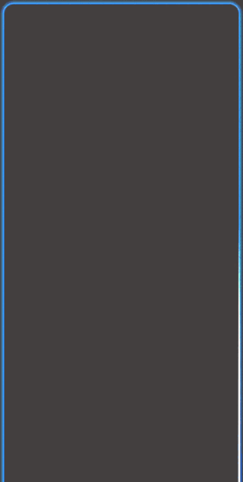
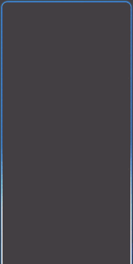

# EdgeGlowView

[](https://android-arsenal.com/api?level=21)
[](LICENSE)

A lightweight Android custom View that renders a **multi-layer edge breathing glow** combined with **dual opposing comet streaks** along the screen border — similar to the animated edge effect seen in Xiaomi's XiaoAi assistant or Apple's Siri.

> Pure Canvas drawing · No third-party dependencies · API 21+ · Kotlin

---

## Preview

| Start from Top | Start from Bottom |
|:-:|:-:|
|  |  |

Comets depart from the anchor point in **opposite directions**, travel around the full border, and meet at the opposite side — then instantly restart.

---

## Features

- ✅ Three-layer gradient stroke breathing glow (outer / mid / inner)
- ✅ Dual comet streaks moving in **opposite directions** along the border
- ✅ Configurable anchor — comets start from **top-center** or **bottom-center**
- ✅ Fully dynamic color change at runtime (no restart needed)
- ✅ Single / dual comet toggle
- ✅ Zero external dependencies — pure `Canvas` + `ValueAnimator`
- ✅ Hardware-accelerated, no `BlurMaskFilter` (avoids common ROM compat bug)
- ✅ Safe lifecycle handling — animators auto-cancel in `onDetachedFromWindow`

---

## Installation

### Option A — Copy single file (simplest)

Copy [`EdgeGlowView.kt`](edgeglowview/src/main/java/com/github/edgeglowview/EdgeGlowView.kt) directly into your project. That's the only file needed — no dependencies, no setup.

### Option B — JitPack (coming soon)

```groovy
// settings.gradle
dependencyResolutionManagement {
    repositories {
        maven { url 'https://jitpack.io' }
    }
}

// build.gradle (app)
dependencies {
    implementation 'com.github.yu-day:EdgeGlowView:1.0.0'
}
```

---

## Usage

### 1. Add to layout XML

Place `EdgeGlowView` as the **last child** of your root layout so it renders on top of all content:

```xml
<androidx.constraintlayout.widget.ConstraintLayout
    android:layout_width="match_parent"
    android:layout_height="match_parent">

    <!-- Your normal UI here -->

    <com.yuday.up.widget.EdgeGlowView
        android:id="@+id/edgeGlowView"
        android:layout_width="match_parent"
        android:layout_height="match_parent"
        android:visibility="gone" />

</androidx.constraintlayout.widget.ConstraintLayout>
```

> **RelativeLayout**: declare `EdgeGlowView` last so it stacks on top.

### 2. Control from Kotlin

```kotlin
// Start
binding.edgeGlowView.glowColor = Color.parseColor("#378ADD")
binding.edgeGlowView.startGlow()

// Change color while running (no restart needed)
binding.edgeGlowView.glowColor = Color.parseColor("#1D9E75")

// Stop and hide
binding.edgeGlowView.stopGlow()
```

### 3. VPN / connection state example

```kotlin
fun applyConnectionState(state: VpnState) {
    when (state) {
        VpnState.CONNECTING   -> {
            binding.edgeGlowView.glowColor = Color.parseColor("#378ADD") // blue
            binding.edgeGlowView.startGlow()
        }
        VpnState.CONNECTED    -> binding.edgeGlowView.glowColor = Color.parseColor("#1D9E75") // green
        VpnState.ERROR        -> binding.edgeGlowView.glowColor = Color.parseColor("#E24B4A") // red
        VpnState.DISCONNECTED -> binding.edgeGlowView.stopGlow()
    }
}
```

---

## Properties

| Property | Type | Default | Description |
|---|---|---|---|
| `glowColor` | `Int` (ARGB color) | `#378ADD` | Color of glow layers and comet streaks |
| `cornerRadius` | `Float` (px) | auto (5% of min side) | Corner radius; match your screen or container |
| `dualComet` | `Boolean` | `true` | `true` = two opposing comets; `false` = single comet |
| `startFromBottom` | `Boolean` | `false` | Anchor point: `false` = top-center, `true` = bottom-center |

---

## How it works

```
┌─────────────────────────────────────┐
│  Layer 1 (outer)  strokeWidth ~12px │  ← low alpha, wide soft halo
│  ┌───────────────────────────────┐  │
│  │  Layer 2 (mid)   ~5px        │  │  ← medium alpha
│  │  ┌─────────────────────────┐ │  │
│  │  │  Layer 3 (inner) ~2.5px │ │  │  ← high alpha, sharpest edge
│  │  │                         │ │  │
│  │  │  ◎ ←── comet A         │ │  │  ← PathMeasure comet (reverse)
│  │  │         comet B ──→ ◎  │ │  │  ← PathMeasure comet (forward)
│  │  └─────────────────────────┘ │  │
│  └───────────────────────────────┘  │
└─────────────────────────────────────┘
```

**Breathing glow** — Three `RoundRect` strokes with alpha driven by `sin()` easing, creating a natural inhale/exhale rhythm.

**Comet streaks** — `PathMeasure.getSegment()` extracts a sub-path for each comet. A `LinearGradient` shader is mapped via `Matrix` (scale → rotate → translate) onto the comet segment each frame, producing a transparent-tail → bright-white-head gradient that stays correctly oriented regardless of which edge the comet is crossing.

**Anchor detection** — `findEdgeMidOffset()` samples 200 points along the closed border path to find the exact path-distance that corresponds to the top-center (or bottom-center) pixel, ensuring the comet origin is visually centered on any screen size or corner radius.

---

## Performance

| Metric | Result |
|---|---|
| Allocations per frame in `onDraw` | **0** — all objects pre-allocated as member variables |
| Rendering | Hardware-accelerated `Canvas` |
| Extra threads | None — runs on `Choreographer` via `ValueAnimator` |
| Memory overhead | < 0.5 MB |

---

## Requirements

- Android **API 21+**
- Kotlin 1.7+ (Java-compatible via `@JvmOverloads`)
- No dependencies beyond the Android SDK

---

## License

```
MIT License  —  Copyright (c) 2025 WANG YU
```

See [LICENSE](LICENSE) for full text.

---

## Contributing

Issues and pull requests are welcome.
For major changes please open an issue first to discuss what you'd like to change.

---

*Inspired by the edge lighting effects of Xiaomi XiaoAi and Apple Siri.*

